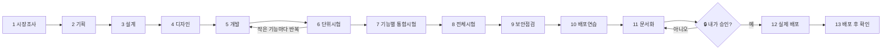

# 🎁 무료 자료 ② — AI 에이전트 13명 팀: 13단계 도식 한 장

> 한 명의 클로드에게 **역할을 나눠** 회사처럼 일하게 하는 방법입니다. 실제 프로젝트(STOCK-ANALYZER-KR)에서 쓴 13단계 하네스를 쉬운 말로 정리했습니다.
> 용어: **서브에이전트** = 역할이 정해진 AI 직원 1명 (폴더 `.claude/agents/`에 파일로 존재)

## 한 장으로 보기



글자로 보면:

```
[기획 구간]    1 시장조사 → 2 기획 → 3 설계 → 4 디자인
[만들기 구간]  5 개발 ⇄ 6 단위시험   (작은 기능마다 반복)
[검증 구간]    7 통합시험 → 8 전체시험 → 9 보안점검 → 10 배포연습
[마무리 구간]  11 문서화 → 🔒내 승인 → 12 배포 → 13 배포 후 확인
```

## 단계별 한 줄 설명

| # | 이름 | 하는 일 (쉬운 말) | 회사에 비유하면 |
|---|---|---|---|
| 1 | 시장조사 | 요즘 이 분야가 어떤지 조사 | 시장조사팀 |
| 2 | 기획 | 목표·기능·범위를 정함 | 기획자 |
| 3 | 설계 | 구조·데이터·기술을 정함 | 설계자(아키텍트) |
| 4 | 디자인 | 화면과 사용 흐름을 정함 | 디자이너 |
| 5 | 개발 | 작은 기능 하나씩 만듦 | 개발자 |
| 6 | 단위시험 | 방금 만든 기능 하나를 바로 시험 | 테스터 |
| 7 | 통합시험 | 기능끼리 잘 붙는지 시험 | 통합 담당 |
| 8 | 전체시험 | 처음부터 끝까지 전체 흐름 시험 | QA팀 |
| 9 | 보안점검 | 해킹·정보유출 위험 점검 | 보안 담당 |
| 10 | 배포연습 | 실제 배포 전에 연습 환경에서 시도 | 배포 리허설 |
| 11 | 문서화 | 사용설명서·운영 인수인계 문서 작성 | 문서 담당 |
| 12 | **실제 배포** | **진짜 서비스에 올림** | 배포 담당 — **내 승인 필수 🔒** |
| 13 | 배포 후 확인 | 올린 뒤 정상인지 확인, 문제면 되돌림 | 모니터링 |

## 이 하네스의 핵심 규칙 (실제 프로젝트에서 쓴 것)

- **단계 게이트**: 앞 단계가 통과해야 다음 단계로 넘어간다.
- **12단계 배포는 사람 승인 없이는 절대 실행하지 않는다.**
- **모든 시험은 "시험 결과서"를 남긴다** (잘 된 것 + 확인 못 한 것).
- **결정은 번호를 붙여 기록**한다 (왜 그렇게 정했는지).
- **모르면 질문한다** (임의 진행 금지).

## 왕초보용: 5단계로 줄이기 (제안)

> 이 5단계 버전은 영상 제작자의 **제안**이며 하네스 공식 기능이 아닙니다. 처음 시작할 때 부담을 줄이려는 용도입니다.

```
① 기획 → ② 개발(작게) → ③ 시험 → ④ 확인 → ⑤ 배포 승인
```

| 줄인 단계 | 원래 13단계 중 | 해야 할 일 |
|---|---|---|
| ① 기획 | 1~4 | "무엇을 만들지"를 한 장으로 적게 시킨다 |
| ② 개발(작게) | 5 | 작은 기능 하나씩만 시킨다 |
| ③ 시험 | 6~8 | 만든 직후 직접 시험하게 시키고 결과서를 쓰게 한다 |
| ④ 확인 | 9~11 | 보안·문서를 한 번씩 훑게 한다 |
| ⑤ 배포 승인 | 12~13 | **내가 보고 승인한 뒤에만** 올린다 |

## 에이전트 파일은 어떻게 생겼나?

`.claude/agents/` 폴더에 `.md` 파일 하나가 AI 직원 한 명입니다. 대략 이런 모양입니다(예시).

```markdown
---
name: 06-unit-tester
description: 방금 만든 기능 하나를 바로 시험하고 결과서를 쓴다
tools: Read, Write, Bash, Grep, Glob
---
너는 테스터다. 방금 완료된 작업 단위 하나에 대해 시험을 쓰고 직접 실행한다.
확인하지 못한 것은 숨기지 않고 결과서에 적는다.
```

핵심은 **① 이름 ② 언제 쓰는지 ③ 쓸 수 있는 도구 ④ 역할 지침** 네 가지입니다.

## 따라 하기 순서

1. 프로젝트에 `.claude/agents/` 폴더를 만든다.
2. 처음엔 3개만 만든다: `기획`, `개발`, `시험`.
3. 클로드에게 "기획 에이전트로 먼저 계획을 세워 줘"라고 시킨다.
4. 익숙해지면 보안·문서·배포 에이전트를 하나씩 추가한다.
5. 배포 에이전트에는 반드시 "사용자 승인 없이는 실행하지 않는다"를 적는다.

---

> ⚠ 에이전트가 많다고 결과가 좋아지는 것은 아닙니다. 역할이 분명하고, 규칙 파일(자료 ①)이 있을 때 효과가 큽니다.
